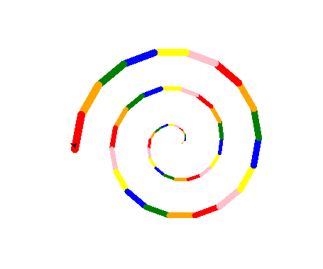

# 4. Lekce (želva)

Pro vyzkoušení praktických dovedností se nyní podíváme na modul, který je obsažený v každé instalaci Pythonu - `turtle`. Modul zobrazí okno (GUI) s bílým plátnem, po kterém se může pohybovat želva (pero). Její pohyb zanechává barevnou stopu, pomocí které lze vytvářet různé grafické obrazce.

```python
import turtle                   # load module

side_length = 100
angle = 90
for side_number in range(4):
    turtle.forward(side_length) # movement
    turtle.left(angle)          # rotation

turtle.exitonclick()            # exit program on mouse click
turtle.mainloop()               # keep showing window
```

## Základní funkce

[dokumentace](https://docs.python.org/3/library/turtle.html)

- pohyb:
  - turtle.`forward`(int)
  - turtle.`backward`(int)
  - turtle.`circle`(int)
- otočení:
  - turtle.`left`(degrees)
  - turtle.`rigth`(degrees)
- pozicování:
  - turtle.`position`() - získání aktuální pozice např. (440.00,-0.00)
  - turtle.`setx`(int)
  - turtle.`sety`(int)
  - turtle.`goto`(int, int)
  - turtle.`setpos`(int,int)
- pero:
  - turtle.`pendown`()
  - turtle.`penup`()
  - turtle.`pencolor`(color_string)
  - turtle.`width`(int)

### Cvičení

Vytvořte program, který zobrazí:

- libovolný čtverec a obdelník
- obecný n-úhelník. Po spuštění bude chtít od uživatele zadat počet stran a délku jedné strany. Následně zobrazí animaci s kreslením specifikovaného n-úhelníků. Možno rozšířit o zadání barvy, kterou se bude kreslit.
- Pravidelný trojúhelník
- Hvězdu jedním tahem, kvůli komplexnosti pouze hvězdu s lichým počtem vrcholů
    > HINT: Jedná se o drobné rozšíření vykreslení pravidelného trojúhelníku
- kružnice bez použití funkce `circle` - pohyb bude krokovaný, tedy s určitým rozlišením
- zvětšující se kružnice s měnící se barvou


