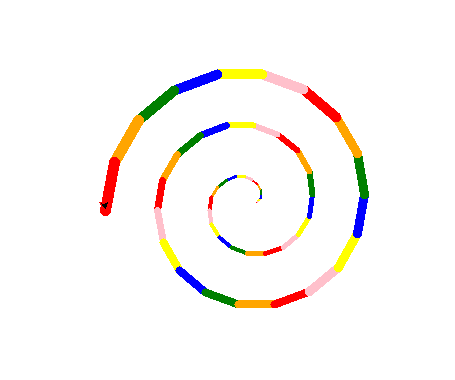

# Modul želva

Pro vyzkoušení praktických dovedností se nyní podíváme na modul, který je obsažený v každé instalaci Pythonu - `turtle`. Modul zobrazí okno (GUI) s bílým plátnem, po kterém se může pohybovat želva (pero). Její pohyb zanechává barevnou stopu, pomocí které lze vytvářet různé grafické obrazce.

```python
import turtle                   # load module

side_length = 100
angle = 90
for side_number in range(4):
    turtle.forward(side_length) # movement
    turtle.left(angle)          # rotation

turtle.exitonclick()            # exit program on mouse click
turtle.mainloop()               # run animation and wait
```

## Základní funkce

[dokumentace](https://docs.python.org/3/library/turtle.html)

-   pohyb:
    -   turtle.`foward`(int)
    -   turtle.`backward`(int)
    -   turtle.`circle`(int)
-   otočení:
    -   turtle.`left`(degrees)
    -   turtle.`rigth`(degrees)
-   pozicování:
    -   turtle.`position`(int, int)
    -   turtle.`setx`(int)
    -   turtle.`sety`(int)
    -   turtle.`goto`(int, int)
    -   turtle.`setpos`(int,int)
-   pero:
    -   turtle.`pendown`()
    -   turtle.`penup`()
    -   turtle.`pencolor`(color_string)
    -   turtle.`width`(int)

### Cvičení

Vytvořte program, který zobrazí:

-   libovolný čtverec a obdelník
-   obecný n-úhelník. Po spuštění bude chtít od uživatele zadat počet stran a délku jedné strany. Následně zobrazí animaci s kreslením specifikovaného n-úhelníků. Možno rozšířit o zadání barvy, kterou se bude kreslit.
-   Pravidelný trojúhelník
-   Hvězdu jedním tahem, kvůli komplexnosti pouze hvězdu s lichým počtem vrcholů
    > HINT: Jedná se o drobné rozšíření vykreslení pravidelného trojúhelníku
-   kružnice bez použití funkce `circle` - pohyb bude krokovaný, tedy s určitým rozlišením
-   zvětšující se kružnice s měnící se barvou


